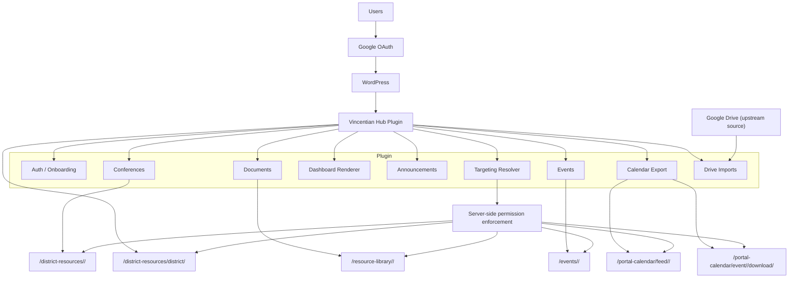

# Vincentian Hub System Diagram

```mermaid
flowchart TD

Users --> GoogleAuth["Google OAuth"]
GoogleAuth --> WordPress

WordPress --> VincentianHub["Vincentian Hub Plugin"]

subgraph Plugin
Auth["Auth / Onboarding"]
Conferences["Conferences"]
Resolver["Targeting Resolver"]
Dashboard["Dashboard Renderer"]
Announcements["Announcements"]
Documents["Documents"]
Events["Events"]
Calendar["Calendar Export"]
Drive["Drive Imports"]
end

VincentianHub --> Auth
VincentianHub --> Conferences
VincentianHub --> Resolver
VincentianHub --> Dashboard
VincentianHub --> Announcements
VincentianHub --> Documents
VincentianHub --> Events
VincentianHub --> Calendar
VincentianHub --> Drive

Conferences --> ConferenceRoute["/district-resources/<conference-name>/"]
VincentianHub --> DistrictRoute["/district-resources/district/"]

Documents --> DocRoute["/resource-library/<doc-slug>/"]
Events --> EventRoute["/events/<event-slug>/"]
Calendar --> FeedRoute["/portal-calendar/feed/<token>/"]
Calendar --> ICSRoute["/portal-calendar/event/<event_id>/download/"]

GoogleDrive["Google Drive (upstream source)"] --> Drive

Resolver --> ProtectedBoundary["Server-side permission enforcement"]
ProtectedBoundary --> ConferenceRoute
ProtectedBoundary --> DistrictRoute
ProtectedBoundary --> DocRoute
ProtectedBoundary --> EventRoute
ProtectedBoundary --> FeedRoute
ProtectedBoundary --> ICSRoute
```
