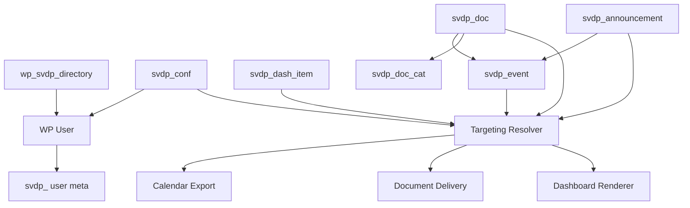

# Vincentian Hub WordPress Data Model Map

This document is a **drift-prevention architecture artifact**.

It exists to make the data model explicit and stable for developers working in WordPress.  
Its purpose is to prevent:

- accidental schema drift
- inconsistent meta-key usage
- resolver mismatches
- CPT/meta/taxonomy confusion
- duplicated or conflicting targeting logic

This document lives at:

`/specs/architecture/wordpress-data-model-map.md`

## Status

**Authoritative architecture companion**  
This document must be treated as a practical implementation map for the data model.

It does **not** override the contracts specification.  
Instead, it operationalizes it.

### Relationship to other documents

- `specs/contracts-spec.md` is the binding contract for canonical names and semantics.
- `specs/architecture/targeting-engine-rules.md` is the binding contract for resolver behavior.
- `specs/architecture/system-diagram.md` defines system boundaries and integrations.
- `specs/architecture/architecture.md` defines implementation structure and module responsibilities.
- `specs/architecture/wordpress-data-model-map.md` defines how WordPress objects, meta, tables, and resolver inputs fit together.

---

# 1. System-of-Record Model

WordPress is the system of record for:

- Conferences
- Dashboard Items
- Announcements
- Documents
- Events
- User access state
- User conference assignment
- User role profiles
- Event calendar exports

Google Drive is an upstream document source only.

---

# 2. Core WordPress Object Types

## Custom Post Types

### `svdp_conf`
Conference records

### `svdp_dash_item`
Persistent dashboard tools, shortcuts, and entry points

### `svdp_announcement`
Targeted announcements and updates

### `svdp_doc`
Curated documents and file records

### `svdp_event`
Events with meeting packets and calendar export

## Taxonomy

### `svdp_doc_cat`
Editorial document categories

## Custom Table

### `wp_svdp_directory`
Trusted imported identity directory for approval/assignment logic

## User Object

Standard WordPress users plus required `svdp_` user meta

---

# 3. Object Relationship Map

---

# 4. User Data Model

## Standard WordPress User

Use core WordPress user record for identity shell.

## Required user meta

- `svdp_account_scope`
- `svdp_approval_status`
- `svdp_conference_id`
- `svdp_role_profiles`
- `svdp_phone`
- `svdp_google_sub`
- `svdp_directory_source`
- `svdp_last_login`
- `svdp_onboarding_completed`
- `svdp_can_self_change_conference`
- `svdp_calendar_feed_token`
- `svdp_calendar_feed_token_rotated_at`
- `svdp_admin_notes`

## User context object derived from meta

The resolver should normalize user data into one context object:

- `user_id`
- `approval_status`
- `account_scope`
- `conference_id`
- `role_profiles[]`
- `conference_flags[]`
- `calendar_feed_token`

This normalized context must be reused everywhere.

Do not rebuild user visibility logic ad hoc inside templates or controllers.

---

# 5. Conference Data Model

## CPT: `svdp_conf`

Purpose:
- canonical conference record
- conference flags
- linked existing page
- resource/voucher context

### Key meta

- `svdp_conf_code`
- `svdp_conf_page_slug`
- `svdp_conf_linked_page_id`
- `svdp_conf_city`
- `svdp_conf_county`
- `svdp_conf_is_urban`
- `svdp_conf_is_rural`
- `svdp_conf_is_new_haven`
- `svdp_conf_is_allen_county`
- `svdp_conf_active`
- `svdp_conf_map_url`
- `svdp_conf_resource_context`
- `svdp_conf_voucher_context`
- `svdp_conf_primary_contact_name`
- `svdp_conf_primary_contact_email`
- `svdp_conf_primary_contact_phone`
- `svdp_conf_help_text_override`

### Conference outputs used by the system

From a conference record the system derives:

- conference ID
- linked district-resources page
- group flags
- shortcode context
- support/help text
- conference-scoped dashboard context

---

# 6. Shared Targeting Block

The following fields are reused identically across:

- `svdp_dash_item`
- `svdp_announcement`
- `svdp_doc`
- `svdp_event`

## Canonical keys

- `svdp_scope`
- `svdp_audience_profiles`
- `svdp_target_conference_mode`
- `svdp_target_conference_ids`
- `svdp_target_group_flags`
- `svdp_is_active`
- `svdp_publish_start`
- `svdp_publish_end`

## Critical implementation rule

These keys are not editorial conveniences.  
They are the resolver interface.

If a developer changes, aliases, duplicates, or partially reimplements these keys, the system is no longer trustworthy.

This is the main reason this document exists.

---

# 7. Content Object Maps

## 7.1 Dashboard Items

### CPT
`svdp_dash_item`

### Purpose
Persistent tools and shortcuts surfaced in dashboard sections

### Key data
- item type
- destination/source
- section placement
- open mode
- shared targeting block
- featured/priority/sort

### Unique keys
- `svdp_item_type`
- `svdp_item_url`
- `svdp_item_shortcode`
- `svdp_item_document_id`
- `svdp_item_linked_item_ids`
- `svdp_item_open_mode`
- `svdp_section_key`
- `svdp_priority`
- `svdp_display_style`
- `svdp_sort_order`
- `svdp_auto_inject_conference_context`
- `svdp_featured`

---

## 7.2 Announcements

### CPT
`svdp_announcement`

### Purpose
Targeted updates, reminders, notices, grants, and banners

### Key data
- type
- body
- placement
- CTA
- shared targeting block

### Unique keys
- `svdp_announcement_type`
- `svdp_priority`
- `svdp_display_placement`
- `svdp_cta_label`
- `svdp_cta_url`
- `svdp_created_by_profile`
- `svdp_internal_notes`
- `svdp_featured`

---

## 7.3 Documents

### CPT
`svdp_doc`

### Purpose
Curated file records that can appear in search, detail pages, dashboard items, and events

### Key data
- source
- preview behavior
- plain-language title
- category
- shared targeting block

### Unique keys
- `svdp_doc_source`
- `svdp_drive_file_id`
- `svdp_drive_parent_ref`
- `svdp_drive_mime_type`
- `svdp_drive_modified_time`
- `svdp_drive_version`
- `svdp_doc_preview_type`
- `svdp_doc_local_cache_path`
- `svdp_doc_thumbnail_path`
- `svdp_doc_search_weight`
- `svdp_doc_featured`
- `svdp_doc_plain_language_title`
- `svdp_doc_help_text`
- `svdp_doc_is_recently_updated`
- `svdp_doc_force_download`
- `svdp_doc_available_for_meeting_packets`

### Taxonomy relationship
`svdp_doc` → `svdp_doc_cat`

---

## 7.4 Events

### CPT
`svdp_event`

### Purpose
Time-based targeted content with meeting packets and calendar export

### Key data
- scheduling
- logistics
- status
- shared targeting block
- packet/document relationships
- export controls

### Unique keys
- `svdp_event_start`
- `svdp_event_end`
- `svdp_event_all_day`
- `svdp_event_timezone`
- `svdp_event_location_name`
- `svdp_event_location_address`
- `svdp_event_virtual_url`
- `svdp_event_registration_url`
- `svdp_event_type`
- `svdp_event_status`
- `svdp_show_on_dashboard`
- `svdp_show_in_calendar`
- `svdp_show_in_whats_new`
- `svdp_featured`
- `svdp_priority`
- `svdp_sort_order`
- `svdp_related_document_ids`
- `svdp_meeting_packet_document_ids`
- `svdp_related_announcement_ids`
- `svdp_event_uid`
- `svdp_event_last_modified_utc`
- `svdp_event_calendar_export_enabled`
- `svdp_event_single_add_enabled`

### Relationship model
An event may reference:
- meeting packet documents
- related documents
- related announcements

It does not own those objects; it links to them.

---

# 8. Trusted Directory Model

## Table: `wp_svdp_directory`

Purpose:
- trusted imported identities
- auto-approval data
- conference assignment defaults
- role profile defaults

### Columns
- `id`
- `first_name`
- `last_name`
- `email`
- `phone`
- `conference_id`
- `account_scope`
- `default_profiles`
- `auto_approve`
- `source_label`
- `updated_at`
- `created_at`

### Important rule
This table is an identity-resolution aid.  
It is not the long-term source of truth for active user context after account creation.

Once a user account exists, the WordPress user + user meta model is authoritative.

---

# 9. Resolver Join Model

This is the most important architectural relationship in the system.

## Inputs to resolver

### User side
- approval status
- account scope
- conference ID
- role profiles
- conference flags

### Object side
- scope
- audience profiles
- conference targeting mode
- conference IDs
- group flags
- active state
- publish window

## Output
- allow
- deny

Optional for logging/tests:
- denial reason

## Critical anti-drift rule
If a feature needs visibility logic, it must call the resolver.

It must not:
- replicate partial checks
- inspect meta keys directly in templates
- hide unauthorized content only in CSS/JS
- assume access from page context alone

---

# 10. Page and Route Model

## Existing conference pages
Existing `/district-resources/<conference-name>` pages remain in place.

Conference page → linked to `svdp_conf` → dashboard rendered dynamically

## District dashboard
Separate dashboard route/page for district users

## Documents
`/resource-library/<doc-slug>/`

## Events
`/events/<event-slug>/`

## Calendar export
- personalized feed
- single-event ICS endpoint

These routes all depend on the same user context + resolver model.

---

# 11. Where This Should Be Referenced

This document should be explicitly referenced in:

## `specs/architecture/architecture.md`
As a required companion to prevent WordPress schema drift

## `specs/issues/SPEC.md`
As a binding architecture constraint for Spec Kit input

## Optional internal developer README notes
As the quickest orientation artifact for how the WordPress data model is wired

### Recommended reference wording

> The WordPress Data Model Map is a drift-prevention architecture artifact.  
> Developers must consult it before changing CPT structures, meta registration, user context, or resolver inputs.  
> It exists to prevent schema drift and inconsistent visibility logic in a WordPress implementation.

---

# 12. Final Rule

If there is ever a conflict between:
- a convenient implementation shortcut
- and this mapped model

the shortcut loses.

This map exists specifically to stop WordPress-specific drift before it starts.
