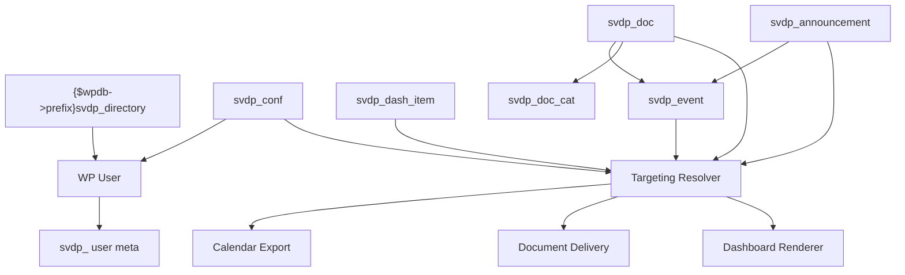

# Vincentian Hub WordPress Data Model Map

This document is a drift-prevention architecture artifact.

It maps WordPress objects, meta, taxonomy, custom table usage, and resolver inputs so developers do not invent alternate schema or relationship logic.

## 1. System-of-Record Model

WordPress is the system of record for:
- conferences
- dashboard items
- announcements
- documents
- events
- user access state
- conference assignment
- role profiles
- event calendar exports

Google Drive is an upstream document source only.

## 2. Core WordPress Object Types

### Custom Post Types
- `svdp_conf`
- `svdp_dash_item`
- `svdp_announcement`
- `svdp_doc`
- `svdp_event`

## Canonical Meta Registration Ownership

The canonical implementation owner for registered object meta keys is:

- `includes/meta-registration.php`

The canonical implementation owner for user-meta-specific handling is:

- `includes/user-meta.php`

Rules:
- canonical object meta keys must be registered centrally
- user-meta-specific registration and normalization must not drift into unrelated modules
- ad hoc meta-key creation inside feature modules is prohibited for contract-locked keys

### Taxonomy
- `svdp_doc_cat`

### Custom Table
- `{$wpdb->prefix}svdp_directory`

### User Object
Standard WordPress users plus required `svdp_` user meta

## 3. Object Relationship Map

## 4. User Data Model

### Required user meta
- `svdp_account_scope`
- `svdp_approval_status`
- `svdp_conference_id`
- `svdp_role_profiles`
- `svdp_phone`
- `svdp_google_sub`
- `svdp_directory_source`
- `svdp_last_login`
- `svdp_onboarding_completed`
- `svdp_can_self_change_conference`
- `svdp_calendar_feed_token`
- `svdp_calendar_feed_token_rotated_at`
- `svdp_admin_notes`

### Normalized user context
The normalized user context schema is:

- `user_id`
- `approval_status`
- `account_scope`
- `conference_id`
- `role_profiles`
- `conference_flags`
- `calendar_feed_token`

This normalized context must be reused everywhere front-end visibility is evaluated.

### Conference Flags Derivation

`conference_flags` in the normalized user context must be derived from the assigned conference object (`svdp_conf`) using the following meta fields:

- `svdp_conf_is_urban`
- `svdp_conf_is_rural`
- `svdp_conf_is_new_haven`
- `svdp_conf_is_allen_county`

Derivation rules:

- Only conferences with `svdp_conf_active = true` may contribute flags.
- Flags are normalized to the targeting values:
  - `urban`
  - `rural`
  - `new_haven`
  - `allen_county`

The resolver must use these normalized values when evaluating `svdp_target_group_flags`.

The normalized user context must **never query conference meta directly during evaluation**.  
All resolver checks must use the pre-computed `conference_flags` field.

## 5. Conference Data Model

### CPT
`svdp_conf`

### Key meta
- `svdp_conf_code`
- `svdp_conf_page_slug`
- `svdp_conf_linked_page_id`
- `svdp_conf_city`
- `svdp_conf_county`
- `svdp_conf_is_urban`
- `svdp_conf_is_rural`
- `svdp_conf_is_new_haven`
- `svdp_conf_is_allen_county`
- `svdp_conf_active`
- `svdp_conf_map_url`
- `svdp_conf_resource_context`
- `svdp_conf_voucher_context`
- `svdp_conf_primary_contact_name`
- `svdp_conf_primary_contact_email`
- `svdp_conf_primary_contact_phone`
- `svdp_conf_help_text_override`

## 6. Shared Targeting Block

The following keys are reused identically across:
- `svdp_dash_item`
- `svdp_announcement`
- `svdp_doc`
- `svdp_event`

### Canonical keys
- `svdp_scope`
- `svdp_audience_profiles`
- `svdp_target_conference_mode`
- `svdp_target_conference_ids`
- `svdp_target_group_flags`
- `svdp_is_active`
- `svdp_publish_start`
- `svdp_publish_end`

These keys are the resolver interface and must not drift.

## 7. Content Object Maps

### 7.1 Dashboard Items
CPT: `svdp_dash_item`

Unique keys:
- `svdp_item_type`
- `svdp_item_url`
- `svdp_item_shortcode`
- `svdp_item_document_id`
- `svdp_item_linked_item_ids`
- `svdp_item_open_mode`
- `svdp_section_key`
- `svdp_priority`
- `svdp_display_style`
- `svdp_sort_order`
- `svdp_auto_inject_conference_context`
- `svdp_featured`

### 7.2 Announcements
CPT: `svdp_announcement`

Unique keys:
- `svdp_announcement_type`
- `svdp_priority`
- `svdp_display_placement`
- `svdp_cta_label`
- `svdp_cta_url`
- `svdp_created_by_profile`
- `svdp_internal_notes`
- `svdp_featured`

### 7.3 Documents
CPT: `svdp_doc`

Unique keys:
- `svdp_doc_source`
- `svdp_drive_file_id`
- `svdp_drive_parent_ref`
- `svdp_drive_mime_type`
- `svdp_drive_modified_time`
- `svdp_drive_version`
- `svdp_doc_preview_type`
- `svdp_doc_local_cache_path`
- `svdp_doc_thumbnail_path`
- `svdp_doc_search_weight`
- `svdp_doc_featured`
- `svdp_doc_plain_language_title`
- `svdp_doc_help_text`
- `svdp_doc_is_recently_updated`
- `svdp_doc_force_download`
- `svdp_doc_available_for_meeting_packets`

Taxonomy relationship:
- `svdp_doc` → `svdp_doc_cat`

### 7.4 Events
CPT: `svdp_event`

Unique keys:
- `svdp_event_start`
- `svdp_event_end`
- `svdp_event_all_day`
- `svdp_event_timezone`
- `svdp_event_location_name`
- `svdp_event_location_address`
- `svdp_event_virtual_url`
- `svdp_event_registration_url`
- `svdp_event_type`
- `svdp_event_status`
- `svdp_show_on_dashboard`
- `svdp_show_in_calendar`
- `svdp_show_in_whats_new`
- `svdp_featured`
- `svdp_priority`
- `svdp_sort_order`
- `svdp_related_document_ids`
- `svdp_meeting_packet_document_ids`
- `svdp_related_announcement_ids`
- `svdp_event_uid`
- `svdp_event_last_modified_utc`
- `svdp_event_calendar_export_enabled`
- `svdp_event_single_add_enabled`

## 8. Trusted Directory Model

### Custom table
`{$wpdb->prefix}svdp_directory`

Columns:
- `id`
- `first_name`
- `last_name`
- `email`
- `phone`
- `conference_id`
- `account_scope`
- `default_profiles`
- `auto_approve`
- `source_label`
- `updated_at`
- `created_at`

Important rule:
This table supports identity resolution and defaults. Once a user account exists, the WordPress user + user meta model is authoritative.

### Directory Data After User Creation

Fields originating from the trusted directory table are **bootstrap inputs only**.

After a WordPress user account exists:

- `default_profiles` from the directory table must not override `svdp_role_profiles`
- `conference_id` from the directory table must not override `svdp_conference_id`
- directory values must not be consulted during resolver evaluation

Authoritative runtime data must come from:

- WordPress user meta
- canonical object meta
- normalized user context

The directory table is therefore a **registration and import source**, not a runtime authority.

### District Account Clarification

The trusted directory table may contain a `conference_id` value for operational or import reasons, but district users must not use that value for targeting after account creation.

Contract rules:

- if a user's `svdp_account_scope = district`, `conference_id` from the directory table is informational only
- district user visibility and authorization must not depend on directory-table `conference_id`
- normalized user context for district users must not derive conference targeting behavior from directory-table `conference_id`

This prevents accidental leakage of conference-scoped logic into district user flows.

## 9. Resolver Join Model

### User-side inputs
- `approval_status`
- `account_scope`
- `conference_id`
- `role_profiles`
- `conference_flags`

### Object-side inputs
- `svdp_scope`
- `svdp_audience_profiles`
- `svdp_target_conference_mode`
- `svdp_target_conference_ids`
- `svdp_target_group_flags`
- `svdp_is_active`
- `svdp_publish_start`
- `svdp_publish_end`

### Output
- allow
- deny

If a feature needs visibility logic, it must call the resolver.
